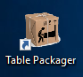

## 

The aims of Table Packager is to gather all the files of a pinball table (table, rom, media, etc.) 
in a single compressed file, a compressed package. You can edit it, add file or info and then 
deploy it on you pincab or distribute it on the web.

For the moment, you can extract table and media files from Pinball X, PinUp System and Visual Pinball X.

A package can be installed on Pin Up System / Pinball X and Visual Pinball

 
    
## Installation

### First Installation

Table Packager is compatible on Windows 7 and more (32 or 64 bits). 

    On Windows 7, you must download Visual C++ Redistributable from 
    https://www.microsoft.com/en-in/download/details.aspx?id=48145, 
    install it and Reboot the system.

To install Table Packager, double click on 

    tablePackager-x.y.z-win32.msi
    
When the following window open, click "Next"

Then, accept the request for elevation of windows and wait during installation

At the end of installation, you should see something like this:

 
 And this icon on your desktop: 
 
 

    Table Packager is installed in C:\Program Files (x86)\tablePackager directory
     
    At the first execution, it creates a working directory in your $HomeDir/tablePackager.

###Upgrade Table Packager

To upgrade Table Packager with a new version, you must To upgrade the software
 you must first uninstall the current version (the packages are kept)
 
 
##Run Package Installer

To launch Table Packager, just double click on the icon:

 
Then, you should see an window like this:

This window is mainly divided into two lists:

- the list of "Installed Tables" that contains all the tables found by Table Packager

- the list of "Packaged Tables" which contains all the packaged tables (empty)

The "Installed Tables" (in red) list contains all table used by Visual Pinball

## Extract and Package a Table

To transform a table and all associated files (sound, rom, flyers, etc.), simply:

1. Select the table to extract from the list "tables installed"

2. Click the "Extract" button.

3. Then, Table Packager searches for all the files linked to this table 
   (you can then see it in the Actions view) and create a file "table package" 
   (Elvira ad the Party Monsters (Bally 1989).zip) containing all the files and metadata.

## Edit a Package

You can now edit this package to rename it, add information files or multimedia:

1. Select it and

2. Click on edition button

Table Package unpack package in a tmp directory and then open an edition windows:

You can add information on the flipper, rename the package, add a file, etc.

### Rename a Package

To rename a package:
 
 1. modify the package name field 
 
 2. Click on rename button
 
 3. All files are renamed 
 
 4. Click on Save button to save the result or click on cancel otherwise
 
### Edit Meta Information

You can add information about each file in a package. For that:

1. Select the file on the treeview and double click on it

2. An meta information window appears, add info and save it

### Add a file

To add a file:

1. Select the file category (Instruction Cards on our example)

2. Click on the 'Add button',

3. Then choose your file with the Select File popup

4. Click on 'Open'

5. If the name of the file to be added is not exactly the same as the name of 
   the package, a popup proposes to rename the file.

### Delete a file

To delete a file:

1. Select the file to delete

2. Click on the 'Del button'

### Rename a file

Except for the rom files, the files must have the same name as the table. 
However, it is possible to have to differentiate the files by renaming the extensions.
So you can make two files live together "Elvira and the Party Monsters.png" in the same 
section by renaming them for example by:

    Elvira and the Party Monsters.1.png
    Elvira and the Party Monsters.2.png

To rename a file:

1. Select the file,

2. Click on rename button,

3. Change extension name

4. Then click on Apply button

### Move file to another section

You can move a file between sections. For example, to move the file Elivia and the Party Monsters.inside2.jpg to Flyers Back section:

1. Select it

2. Click on the "up file" button

3. To move the same file to Instruction Cards section, click on the "down file" button

### Save and file Protection

All changes made in edition will only be applied after the save (button Save).

To avoid overwriting a package by mistake, you can protect 
it by enabling the "Protected" checkbox, and save the package.

A protected package is marked by a blue color in Package Table List.

You can remove the protection by edit the package and unselect "Protected".

## Deploy a package

Your Elvira Package is ready, it's time to install it on your pincab:

1. Select the package

2. Click on Install button

All package files are copied to the different Visual Pinball and PinUp System directories.

You must then import this new pinball into the PinUp System list (run pinUpMenuSetup.exe). 
You can see that all the media are "green" and ready to work in the "MediaManagerForm" window.

## Export and Import a package

You can export a package to share it with an other "Pinball Maniac" by:

1. Select a package to export

2. Click on Export button 

3. Then select the output dir 

In the same way, you can import a package:

1. Click on the Import button

2. Then select the package

    If the imported package was builded by an older version of TablePackager,
    the package is automatically upgraded at importation.
    
## Cleanup Table Files

Many files accumulate in Visual Pinball, VPInMAme, PinUp System, and so on.

You can clean the files of a table by selecting it from the list of tables, 
then click on the delete button.

TablePackager will browse the files installed for the deletes. It also works 
with an installed package.

## Create Package from Scratch

It is also possible to create a package from scratch. To do this, click on 
'create empty package' button:

An table editor appears with 'John Doe' table as Name. First, rename it 
and then edit this new package as it is describe in section [Edit a Package](#Edit-Package)

