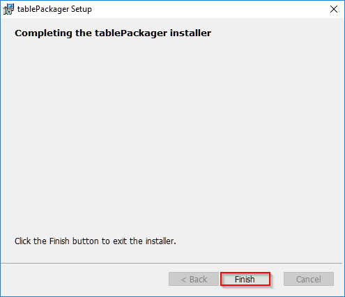
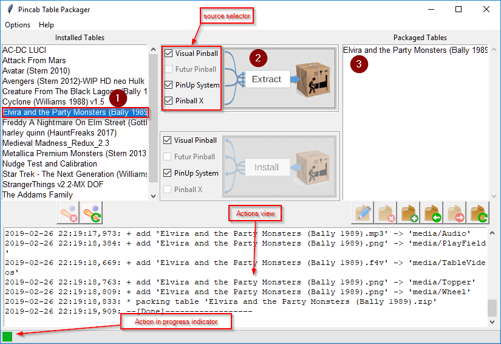

#Table Packager 

The aims of Table Packager is to gather all the files of a pinball table (table, rom, media, etc.) 
in a single compressed file, a compressed package. You can edit it, add file or info and then 
deploy it on you pincab or distribute it on the web.

For the moment, you can extract table and media files from Pinball X, PinUp System and Visual Pinball X.

A package can be installed on Pin Up System and Visual Pinball (Pinballx is not available on installation
because I don't know how Pinball X links media files with it's internal data)

[Installation](#Installation)

[Run Package Installer](#Run-Package-Installer)

[Extract and Package a Table](#Extract-Package-Table)

[Edit a Package](#Edit-Package)

## Installation

Table Packager is compatible on Windows 7 and more (32 or 64 bits). 

    On Windows 7, you must download Visual C++ Redistributable from 
    https://www.microsoft.com/en-in/download/details.aspx?id=48145, 
    install it and Reboot the system.

To install Table Packager, double click on 

    tablePackager-x.y-win32.msi
    
When the following window open, click "Next"

Then, accept the request for elevation of windows and wait during installation

At the end of installation, you should see something like this:

 
 And this icon on your desktop: 
 
 

## Run Package Installer

To launch Table Packager, just double click on the icon:

 
Then, you should see an window like this:

This window is mainly divided into two lists:

- the list of "Installed Tables" that contains all the tables found by Table Packager

- the list of "Packaged Tables" which contains all the packaged tables (empty)

The "Installed Tables" (in red) list contains all table used by Visual Pinball

## Extract and Package a Table

To transform a table and all associated files (sound, rom, flyers, etc.), simply:

1. Select the table to extract from the list "tables installed"

2. Click the "Extract" button.

3. Then, Table Packager searches for all the files linked to this table 
   (you can then see it in the Actions view) and create a file "table package" 
   (Elvira ad the Party Monsters (Bally 1989).zip) containing all the files and metadata.

## Edit a Package

You can now edit this package to rename it, add information files or multimedia:

1. Select it and

2. Click on edition button

Table Package unpack package in a tmp directory and then open a edition windows:

